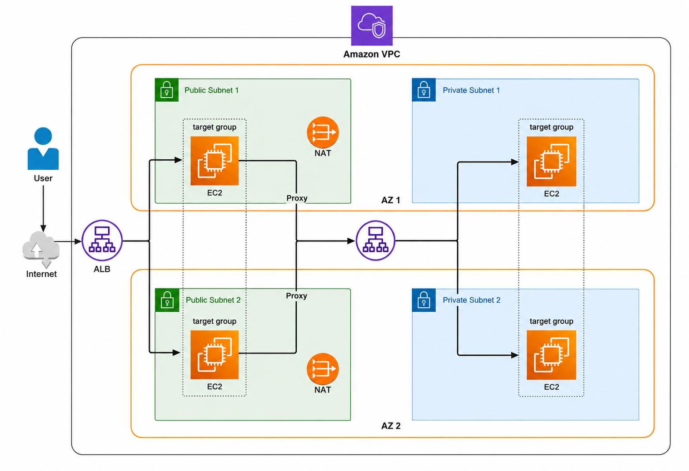

# Three-Tier AWS Infrastructure — Terraform

Provisions the architecture shown in the diagram: a VPC spanning 2 Availability
Zones, public subnets with an internet-facing ALB and EC2 instances (target
group 1), an internal ALB acting as the "proxy" that forwards traffic to a
private-tier target group of EC2 instances, and NAT Gateways for outbound
internet access from the private subnets.

## Architecture



This deployment uses:

- A single VPC with 2 Availability Zones.
- Public subnets in each AZ hosting the internet-facing ALB and public EC2 targets.
- Private subnets in each AZ hosting the private-tier EC2 instances.
- An internal ALB deployed in the private subnets that acts as the proxy between the public tier and the private tier.
- NAT Gateways in the public subnets so private instances can access the internet for updates and outbound traffic.

## Modules

| # | Module              | Responsibility                                                        |
|---|----------------------|------------------------------------------------------------------------|
| 1 | `modules/vpc`        | VPC + Internet Gateway                                                |
| 2 | `modules/subnets`    | Public/private subnets across AZs, NAT Gateways, route tables         |
| 3 | `modules/load_balancers` | External (internet-facing) ALB + internal ALB ("proxy"), target groups, listeners, security groups |
| 4 | `modules/instances`  | EC2 instances (public + private tier) and their security groups       |
| 5 | `modules/remote_backend` | S3 bucket + DynamoDB table for remote state (used from `bootstrap/`) |

## Directory layout

```
terraform-aws-infra/
├── bootstrap/              # run first, once — creates the S3/DynamoDB backend
│   ├── main.tf
│   ├── variables.tf
│   ├── outputs.tf
│   └── terraform.tfvars.example
├── modules/
│   ├── vpc/
│   ├── subnets/
│   ├── load_balancers/
│   ├── instances/
│   └── remote_backend/
├── versions.tf              # providers + S3 backend config
├── main.tf                  # wires modules 1-4 together
├── variables.tf
├── outputs.tf
└── terraform.tfvars.example
```

## Usage

### 1. Bootstrap the remote backend (one-time)

```bash
cd bootstrap
cp terraform.tfvars.example terraform.tfvars   # edit state_bucket_name to something globally unique
terraform init
terraform apply
```

Note the `state_bucket_name` and `lock_table_name` you used — you'll need them next.

### 2. Point the root project at that backend

Edit `versions.tf` in the project root: set `bucket`, `region`, and
`dynamodb_table` in the `backend "s3"` block to match what you created in
step 1.

### 3. Deploy the main infrastructure

```bash
cd ..   # back to the project root
cp terraform.tfvars.example terraform.tfvars   # adjust as needed
terraform init
terraform plan
terraform apply
```

### 4. Test

```bash
terraform output external_alb_dns_name
curl http://$(terraform output -raw external_alb_dns_name)
```

## Notes

- Each AZ gets its own NAT Gateway for high availability (avoids a single
  point of failure and cross-AZ data transfer costs).
- The internal ALB (the "proxy" in the diagram) is deployed in the private
  subnets and only accepts traffic from within the VPC CIDR — it is not
  internet-reachable.
- Target group attachments are created in the root `main.tf` rather than
  inside the `load_balancers` or `instances` modules, to avoid a circular
  module dependency (instances need the ALBs' security group IDs; the ALBs'
  target groups need the instances' IDs).
- Default AMI is auto-resolved to the latest Amazon Linux 2023 image; override
  with `ami_id` if you need something specific.
- Adjust `az_count` / CIDR lists together if you want more than 2 AZs.
